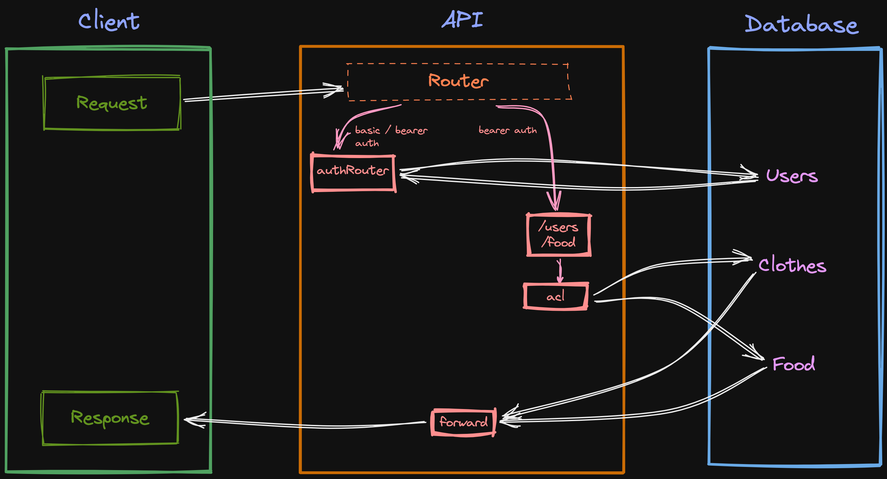

# Lab - Class 08

## Project: Auth API

### Author: Julian Barker

### Problem Domain  

This repo is an API server that has routes for signup, sign-in, and role-based access control for CRUD operations in food and clothes routes. It uses basic and bearer auth.

### Links and Resources

- [deployment](https://four01-auth-api.onrender.com)

### Setup

#### `.env` requirements (where applicable)

- `PORT` - 3001
- `DATABASE_URL` - postgres://localhost:5432/\<database-name\>?sslmode=disable

#### How to initialize/run your application (where applicable)

- `npm start` (alias for `node index.js`)

#### Features / Routes

- GET : `/` - return "We're live!!!"
- POST : `/signup` - provide username and password in the body, and receive encryptede jwt token as a response
- POST : `/signin` - provide username and password as basic auth
- POST : `api/v2/:model` (food/clothes) - create a new record
- GET : `api/v2/:model` (food/clothes) - get all records
- GET : `api/v2/:model/:id` (food/clothes) - get a single record by id
- PUT : `api/v2/:model/:id` (food/clothes) - update a single record by id
- DELETE : `api/v2/:model/:id` (food/clothes) - delete a single record by id

- Access controls:

  - admin: READ, WRITE, UPDATE, DELETE
  - editor: READ, WRITE, UPDATE
  - writer: READ, WRITE
  - user: READ

#### Tests

- test suite was provided as starter code
- run tests with `npm test`

#### UML

### Attributions
